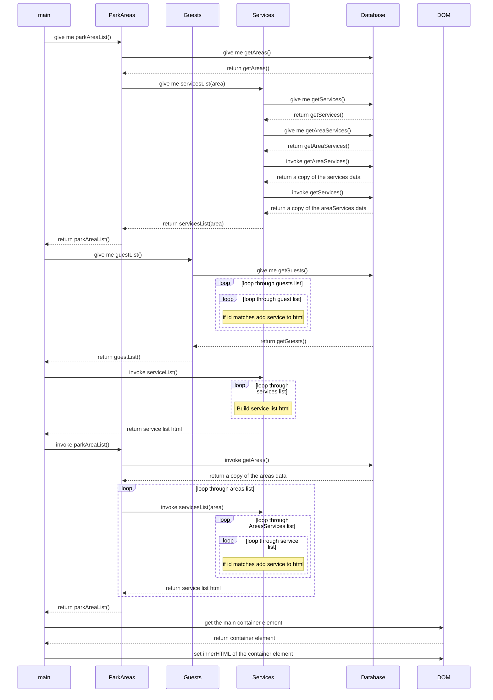

```mermaid

sequenceDiagram
participant main
participant ParkAreas
participant Guests
participant Services
participant Database
participant DOM

main->>ParkAreas: give me parkAreaList()
    ParkAreas->>Database: give me getAreas()
    Database-->>ParkAreas: return getAreas()
    ParkAreas->>Services: give me servicesList(area)
        Services->>Database: give me getServices()
        Database-->>Services: return getServices()
        Services->>Database: give me getAreaServices()
        Database-->>Services: return getAreaServices()
        Services->>Database: invoke getAreaServices()
        Database-->>Services: return a copy of the services data
        Services->>Database: invoke getServices()
        Database-->>Services: return a copy of the areaServices data
    Services-->>ParkAreas: return servicesList(area)
ParkAreas-->>main: return parkAreaList()

main->>Guests: give me guestList()
    Guests->>Database: give me getGuests()
    loop loop through guests list
            loop loop through guest list
                note over Services: if id matches add service to html
            end
        end
    Database-->>Guests: return getGuests()
Guests-->>main: return guestList()

main->>Services: invoke serviceList()
    loop loop through services list
        note over Services: Build service list html
    end
Services-->>main: return service list html

main->>ParkAreas: invoke parkAreaList()
ParkAreas->>Database: invoke getAreas()
Database-->>ParkAreas: return a copy of the areas data
loop loop through areas list
    ParkAreas->>Services: invoke servicesList(area)
        loop loop through AreasServices list
            loop loop through service list
                note over Services: if id matches add service to html
            end
        end
    Services-->>ParkAreas: return service list html
end
ParkAreas-->>main: return parkAreaList()

main->>DOM: get the main container element
DOM-->>main: return container element
main->>DOM: set innerHTML of the container element
```